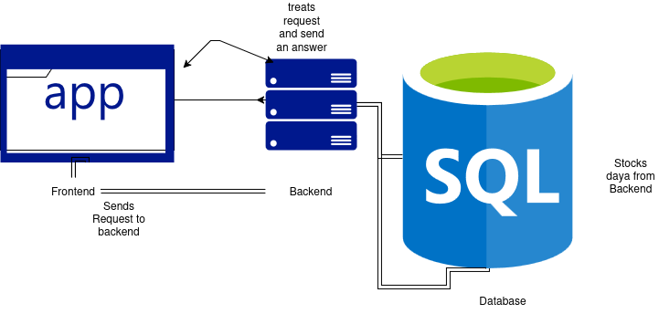

# AgroNova
This project answers a real problem.
Which is: How do we access local product in our towns?
How do our cultivators make the population access fresh products?

AgroNova helps us access local and organic product through a platform.

## Setup

Clone Repository:

```bash
git clone https://MVP_LagosTrip-FreeProject_2025/
cd  MVP_LagosTrip-FreeProject_2025
```

Launch the server and the client

```bash
cd FRONT
npm install && npm run serve

// you can check it out on the http adress shown in you terminal

cd agronova_backend
npm install && npm start

// you can check it out on the http adress shown in you terminal

```

## Architecture

